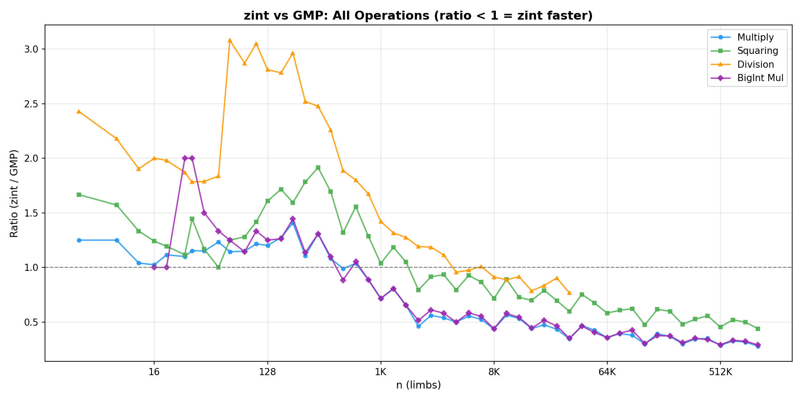
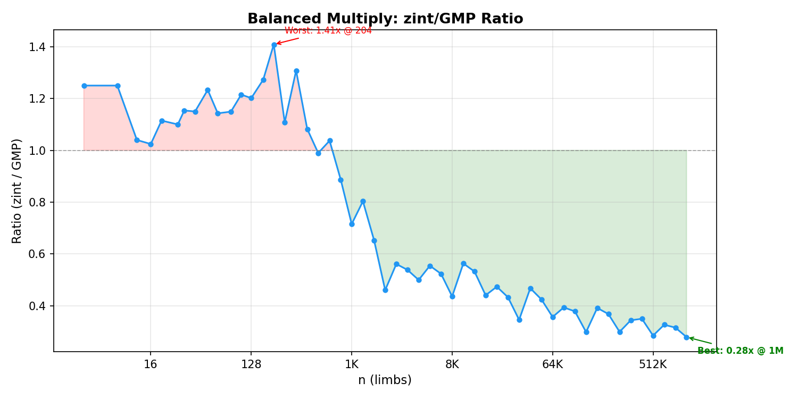
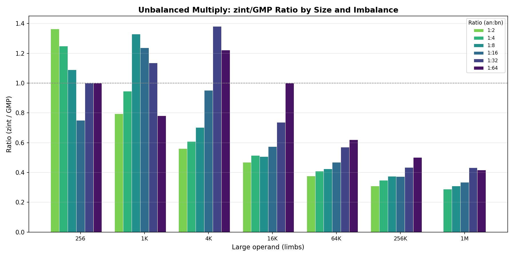
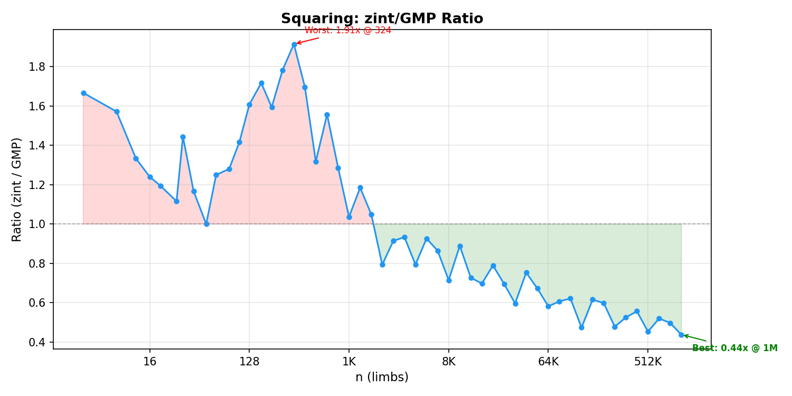
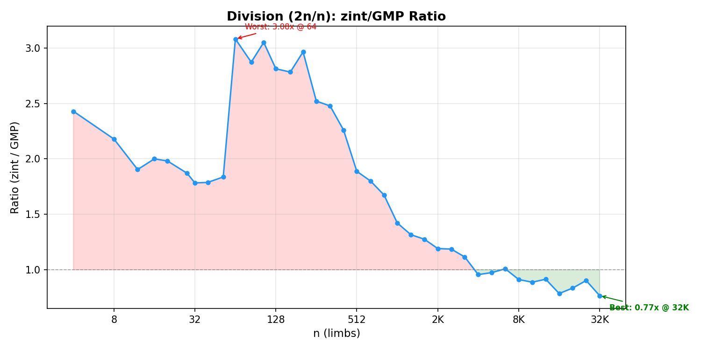

# NTT3

AVX2 big-integer multiplication via NTT with mixed-radix support. Header-only C++17, ~8,300 SLOC.

**Up to 3.6x faster than GMP** for balanced multiply at large sizes; consistently faster from ~800 limbs onward.



## Performance vs GMP

Benchmarked on AMD Zen 4 (single-threaded), compiled with GCC 14.2 `-O2 -mavx2`. GMP 6.3.0 (MSYS2 ucrt64). Sizes up to 1M u64 limbs (8 MB per operand).

### Balanced Multiply (n x n)



| Size | zint | GMP | Ratio |
|------|------|-----|-------|
| 512 | 24 us | 25 us | 0.99x |
| 4K | 195 us | 390 us | **0.50x** |
| 32K | 1.73 ms | 4.99 ms | **0.35x** |
| 131K | 7.4 ms | 24.9 ms | **0.30x** |
| 1M | 74 ms | 267 ms | **0.28x** |

Crossover at ~512 limbs. NTT kicks in at 1K limbs (p30x3 engine), scaling to 3.6x faster.

### Unbalanced Multiply



zint wins even for highly unbalanced multiplications (64:1 ratio) when the large operand exceeds ~16K limbs. At 1M x 16K (1:64), zint is 2.4x faster.

### Squaring



| Size | Ratio | Notes |
|------|-------|-------|
| 256 | 1.78x | GMP has dedicated sqr basecase |
| 2K | **0.79x** | NTT crossover |
| 32K | **0.60x** | |
| 1M | **0.44x** | 2.3x faster |

### Division



Division (2n / n) converges around 4K limbs. Newton division reaches 0.77x at 32K limbs.

### String Conversion

| Operation | Crossover | At 64K limbs |
|-----------|-----------|--------------|
| to_string | ~46K limbs | **0.92x** |
| from_string | ~8K limbs | **0.78x** |

### addmul_1

The ASM kernel (ADX/BMI2, 4-way unrolled) ties or beats GMP's `mpn_addmul_1` across all sizes.

## Architecture

### Two NTT Engines

The library selects the faster engine based on operand size:

- **p30x3** (n <= 6M u32 limbs): Three ~30-bit primes, u32 Montgomery arithmetic. Faster for small-to-medium sizes.
- **p50x4** (n > 6M u32 limbs): Four ~50-bit primes, double-precision FMA Barrett arithmetic. Handles arbitrarily large sizes via mixed-radix + Bailey 4-step.

### Three-Prime NTT (p30x3)

Convolution modulo three NTT-friendly primes, combined via CRT:

| Prime | Value | p - 1 |
|-------|-------|-------|
| P0 | 880803841 | 105 * 2^23 + 1 |
| P1 | 754974721 | 90 * 2^23 + 1 |
| P2 | 377487361 | 45 * 2^23 + 1 |

Product P0 * P1 * P2 ~ 2^88, sufficient for u32 limb convolutions up to 3 * 2^23 elements.

### Four-Prime NTT (p50x4)

For larger sizes, four ~50-bit primes with 80-bit coefficient packing:

| Prime | Value | p - 1 |
|-------|-------|-------|
| P0 | 519519244124161 | 2^39 * 945 + 1 |
| P1 | 750416685957121 | 2^39 * 1365 + 1 |
| P2 | 865865406873601 | 2^39 * 1575 + 1 |
| P3 | 1096762848706561 | 2^39 * 1995 + 1 |

Product ~ 2^196, sufficient for u64 limb convolutions. All primes support NTT sizes up to 5 * 2^39.

### Mixed-Radix NTT

Transform sizes are {1, 3, 5} * 2^k, reducing worst-case padding from 2x to ~1.33x. Forward uses DIF (decimation-in-frequency) outer radix-m pass, then m independent radix-4/2 NTTs. Inverse is the reverse with fused scaling.

### Key Optimizations

- **Twisted convolution**: negacyclic product mod (x^8 - w) via 8-point cyclic convolution within each AVX2 vector, avoiding 2x zero-padding
- **Lazy Montgomery reduction**: intermediates in [0, 4M) range, minimizing modular ops
- **Ruler-sequence root updates**: cache-friendly blocked traversal, no root table lookups
- **Bailey 4-step** (p50x4): cache-oblivious transpose + 4x-unrolled twiddle for large transforms
- **ADX/BMI2 ASM kernels**: hand-written addmul_1 (~1.7 cyc/limb), submul_1, mul_basecase
- **NTT squaring**: detects self-multiply, skips redundant forward transform (saves ~33%)

## Project Structure

```
ntt/                              -- NTT engine (4,530 lines)
  common.hpp                      -- types, aligned alloc, smooth size table
  api.hpp                         -- public API: big_multiply(), big_multiply_u64()
  arena.hpp                       -- pooled aligned memory allocator
  profile.hpp                     -- cycle-counter profiling infrastructure
  simd/
    avx2.hpp                      -- AVX2 u32 intrinsics (p30x3)
    v4.hpp                        -- AVX2 double intrinsics (p50x4)
  p30x3/                          -- 3-prime ~30-bit NTT engine
    mont_scalar.hpp               -- scalar Montgomery arithmetic (constexpr)
    mont_vec.hpp                  -- SIMD Montgomery arithmetic
    root_plan.hpp                 -- precomputed roots of unity
    radix4.hpp                    -- radix-4 DIF/DIT butterfly kernels
    radix2.hpp                    -- radix-2 pass (odd-log sizes)
    radix3.hpp, radix5.hpp        -- outer radix-3/5 DIF/DIT
    cyclic_conv.hpp               -- twisted convolution (freq-domain multiply)
    scheduler.hpp                 -- NTT orchestration, mixed-radix dispatch
    crt.hpp                       -- three-prime CRT + carry propagation
  p50x4/                          -- 4-prime ~50-bit NTT engine
    common.hpp                    -- prime definitions, allocation
    fft_ctx.hpp                   -- per-prime FFT context (roots, Barrett)
    fft.hpp                       -- radix-4/2 DIF/DIT, small FFT kernels
    mixed_radix.hpp               -- radix-3/5 passes, size selection
    bailey.hpp                    -- Bailey 4-step (transpose + twiddle)
    pointmul.hpp                  -- frequency-domain multiply/square
    crt.hpp                       -- SIMD Garner CRT + Horner 80-bit packing
    multiply.hpp                  -- Ntt4 engine, 80-bit extraction, top-level API

zint/                             -- BigInt library (3,750 lines, submodule)
  bigint.hpp                      -- full bigint class, D&C radix conversion
  mpn.hpp                         -- low-level limb ops (add, sub, shift, mul_1, divrem_1)
  mul.hpp                         -- basecase -> Karatsuba (>=32) -> NTT (>=1024) multiply
  div.hpp                         -- schoolbook (<60) -> Newton (>=60) division
  tuning.hpp                      -- algorithm crossover thresholds
  scratch.hpp                     -- scratch memory allocator
  asm/                            -- hand-written ASM kernels
    addmul_1_adx.asm/.S           -- 4-way ADX/BMI2 (~1.7 cyc/limb)
    submul_1_adx.asm/.S           -- 2-way BMI2 (~2.2 cyc/limb)
    mul_basecase_adx.asm/.S       -- fused schoolbook (2.3x vs scalar)

bench/                            -- benchmarks & plotting
  bench_extended.cpp              -- full GMP comparison (CSV output, up to 1M limbs)
  bench_vs_gmp.cpp                -- quick GMP comparison
  bench_vs_gmp_str.cpp            -- string conversion benchmark
  plot_bench.py                   -- matplotlib plotting script

plots/                            -- benchmark result plots
tools/                            -- utility scripts (prime finding, plotting)
docs/                             -- algorithm documentation (Chinese)
```

## Build

Requires C++17 and AVX2 support.

### MSVC

```bat
cl /EHsc /O2 /arch:AVX2 /std:c++17 test_bigint.cpp /Fe:test.exe
```

### GCC / Clang

```bash
g++ -O2 -mavx2 -mbmi2 -madx -mfma -std=c++17 test_bigint.cpp -o test
```

### Benchmark vs GMP (MSYS2)

```bash
g++ -std=c++17 -O2 -mavx2 -mbmi2 -madx -mfma -I. -static \
    bench/bench_extended.cpp zint/asm/*.obj -lgmp -o bench.exe
./bench.exe                  # outputs bench_results.csv
python bench/plot_bench.py   # generates plots/
```

## Usage

```cpp
#include "ntt/api.hpp"

// u32 limbs (base 2^32)
ntt::big_multiply(out, out_len, a, na, b, nb);

// u64 limbs (base 2^64) -- auto-dispatches p30x3 vs p50x4
ntt::big_multiply_u64(out, out_len, a, na, b, nb);
```

```cpp
#include "zint/bigint.hpp"

zint::bigint a("123456789012345678901234567890");
zint::bigint b("987654321098765432109876543210");
zint::bigint c = a * b;
std::string s = c.to_string();
```

## Acknowledgements

- [Yuezheng_Ling_fans' NTT submission](https://judge.yosupo.jp/submission/201990) -- the reference implementation the p30x3 engine is based on
- [Codeforces: NTT implementation guide](https://codeforces.com/blog/entry/142063)
- [y-cruncher](http://www.numberworld.org/y-cruncher/) -- inspiration for small-primes NTT and Bailey 4-step
- Brian Gough, *FFT Algorithms* (1997) -- mixed-radix FFT theory
