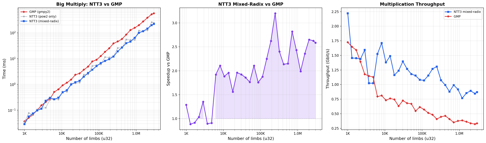

# NTT3

AVX2 big-integer multiplication via three-prime NTT with mixed-radix support.

**2.0 -- 2.6x faster than GMP** at large sizes (>100K limbs). (Not a FAIR comparison! I compared gmpy to my bench implemented with C++. There's certainly wrapping cost, also GMP does allocation stuff)



## Algorithm

The product of two _n_-limb integers (base 2^32) is computed in O(n log n) time using the Number Theoretic Transform (NTT).

### Three-Prime CRT

The convolution is evaluated modulo three NTT-friendly primes independently, then combined via the Chinese Remainder Theorem:

| Prime | Value | Factorization of p-1 |
|-------|-------|----------------------|
| P0 | 880803841 | 105 * 2^23 + 1 |
| P1 | 754974721 | 90 * 2^23 + 1 |
| P2 | 377487361 | 45 * 2^23 + 1 |

The product P0 * P1 * P2 ~ 2^88, sufficient for convolution coefficients up to 2^88.

### Mixed-Radix NTT

Transform sizes are {1, 3, 5} * 2^k, reducing worst-case padding from 2x (power-of-2 only) to ~1.33x(3 vs 4). All three primes have 3 | p-1 and 5 | p-1, enabling exact radix-3 and radix-5 butterflies.

For a size n = m * 2^k (m in {1, 3, 5}):
- **Forward (DIF):** outer radix-m decimation-in-frequency pass, then m independent radix-4/2 NTTs of size 2^k
- **Inverse (DIT):** m independent radix-4/2 inverse NTTs, then outer radix-m decimation-in-time pass with fused 1/m scaling
- **Multiply:** twisted convolution on each sub-array with per-sub-array twist offset

### Base-2 Engine

The power-of-2 core uses a cache-friendly blocked traversal with ruler-sequence root updates (no root table lookups). All arithmetic stays in Montgomery form with lazy reductions ([0, 4M) intermediate range) to minimize modular operations.

Frequency-domain multiplication uses twisted convolution: the negacyclic polynomial product mod (x^8 - w) is computed via 8-point cyclic convolution within each AVX2 vector, avoiding a factor-of-2 zero-padding overhead.

## Project Structure

```
ntt/
  common.hpp              -- types, aligned alloc, ceil_smooth size table
  api.hpp                 -- public API: big_multiply()
  arena.hpp               -- pooled aligned memory allocator
  simd/avx2.hpp           -- AVX2 intrinsics abstraction
  mont/mont_scalar.hpp    -- scalar Montgomery arithmetic (constexpr)
  mont/mont_vec.hpp       -- SIMD Montgomery arithmetic
  roots/root_plan.hpp     -- precomputed roots of unity and twiddle factors
  kernels/
    radix4.hpp            -- radix-4 DIF/DIT butterfly kernels
    radix2.hpp            -- radix-2 pass (odd-log sizes)
    radix3.hpp            -- radix-3 outer DIF/DIT pass
    radix5.hpp            -- radix-5 outer DIF/DIT pass
    cyclic_conv.hpp       -- twisted convolution (freq-domain multiply)
  engine/scheduler.hpp    -- NTT orchestration, mixed-radix dispatch
  multi/crt.hpp           -- three-prime CRT reconstruction + carry propagation
test_correctness.cpp      -- correctness tests (schoolbook + modular verification)
bench_sizes.cpp           -- multi-size benchmark
CMakeLists.txt
```

## Detailed Documentation

- Chinese deep-dive (algorithms + formulas + optimizations): docs/algorithm_and_optimizations_zh.md
- Bailey 4-step compatibility design (with twisted conv): docs/bailey_4step_twisted_conv_compat_zh.md

## Build

Requires C++17 and AVX2 support.

### CMake (recommended)

```bash
cmake -B build -DCMAKE_BUILD_TYPE=Release
cmake --build build --config Release
```

### MSVC (command line)

```bat
cl /EHsc /O2 /arch:AVX2 /std:c++17 test_correctness.cpp /Fe:test_correctness.exe
```

### GCC / Clang

```bash
g++ -O2 -mavx2 -std=c++17 test_correctness.cpp -o test_correctness
```

## Usage

```cpp
#include "ntt/api.hpp"

// a, b: arrays of u32 limbs (little-endian, base 2^32)
// out:  must have room for at least na + nb limbs
ntt::big_multiply(out, out_len, a, na, b, nb);
```

## Test

```bash
./test_correctness   # schoolbook check (n < 1000) + modular verification (n up to 100K)
./bench_sizes        # performance across sizes 1K -- 3M limbs
```

## Acknowledgements

- [Yuezheng_Ling_fans' NTT submission](https://judge.yosupo.jp/submission/201990) -- the reference implementation this project is based on
- [Codeforces: NTT implementation guide](https://codeforces.com/blog/entry/142063)
- [y-cruncher](http://www.numberworld.org/y-cruncher/) -- inspiration for small primes NTT multiplication
- Brian Gough, *FFT Algorithms* (1997) -- mixed-radix FFT theory and sub-transform modules
